# 종합 프로젝트

## 프로젝트 결과

### 1. 팀

* 프로젝트 진행 날짜 : 2020.11.19 - 2019.11.26

* 역할 분담

    | 팀원   | 업무 내용                                                    |      |
    | ------ | ------------------------------------------------------------ | ---- |
    | 김민정 | 1. ERD 모델구성, 계정 기능, 게시판  및 댓글 추가/수정/삭제 기능, 디자인 |      |
    | 이건우 | 1. ERD 모델구성, 영화 및 리뷰 추가/수정/삭제, 평점, 영화추천 기능, 디자인 |      |

* 발표자료 및 스크린샷 `바나무비.pptx`  확인 요망


### 2. 목표 서비스 구현 및 진행도


### 3. ERD


### 4. 기능

* 기능도

  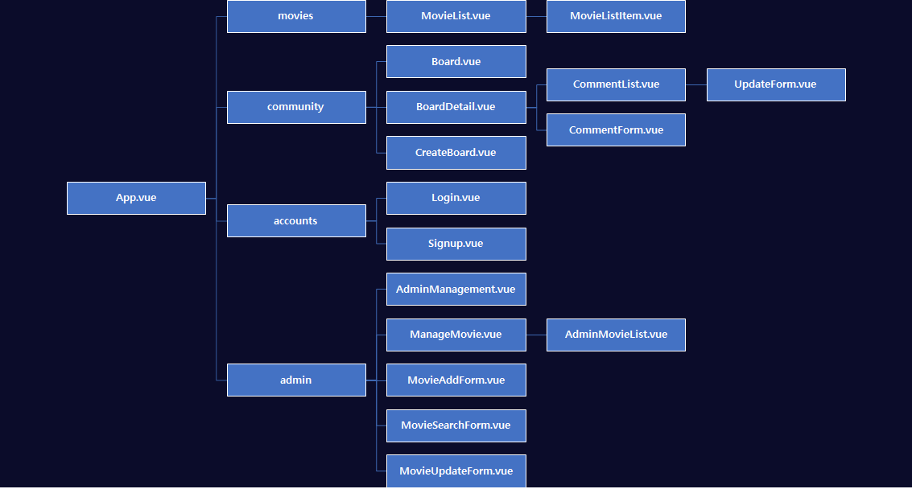

#### 

#### A. 회원가입 / 로그인 / 로그아웃

1) 회원가입

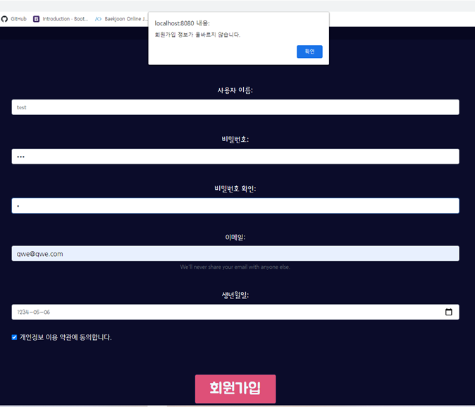

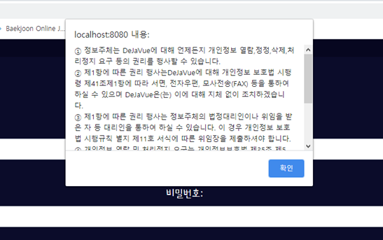

* 개인정보 처리방침 약관 동의 여부를 추가
  
* 개인정보보호종합포탈에서 생성
  
  * 미동의 시 가입 불가 경고창 처리
  
* 입력한 정보가 올바르지 않을 경우 경고창 띄우기

  

2) 로그인

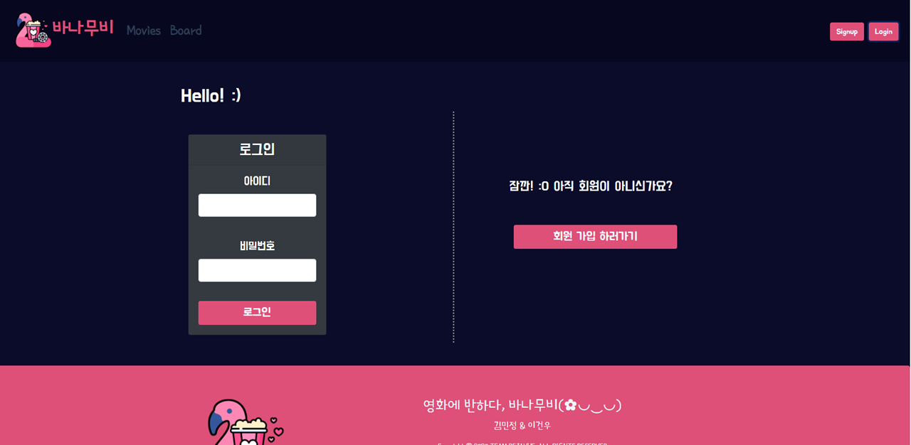

* 입력한 정보가 올바르지 않을 경우 로그인 불가 경고창으로 피드백 제공

* 관리자 계정 로그인 시 관리자 전용 버튼 노출 (영화 추가, 회원 관리)

* JWT 활용

* 로그인 시 로그인한 사용자 정보를 store에 저장

  

3) 로그아웃

* 로그아웃 시 store에 저장된 사용자 정보 초기화


#### B. 영화 리스트, 영화 정보 조회

1) 영화 목록 및 상세정보 조회

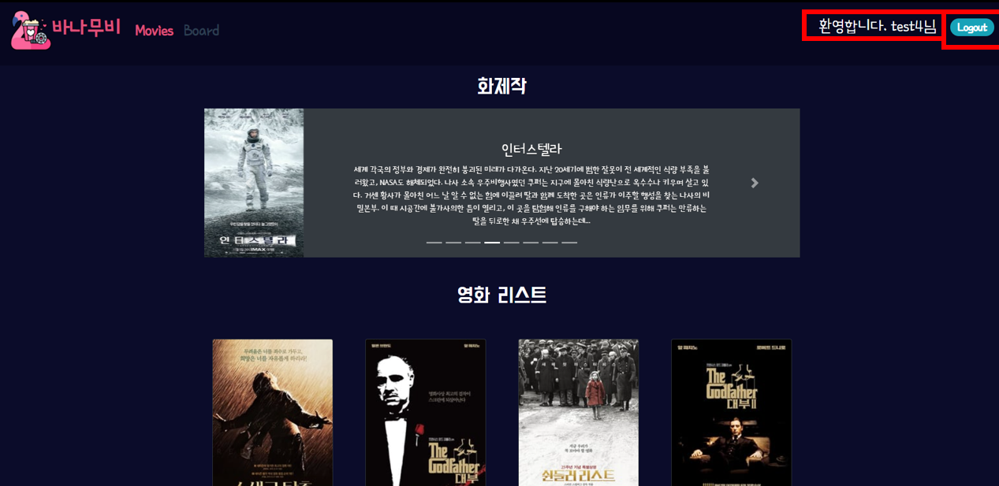

* 로그인하지 않은 일반 사용자도 조회 가능
* 회원들이 매긴 평점을 토대로 계산한 평균 평점 정보를 제공
  * 회원이 평점을 수정하거나 삭제하는 경우, 평점 수치에 적용되어 변동되도록 알고리즘 설계
* Modal을 활용한 스타일링


2) 해당 영화 리뷰 조회

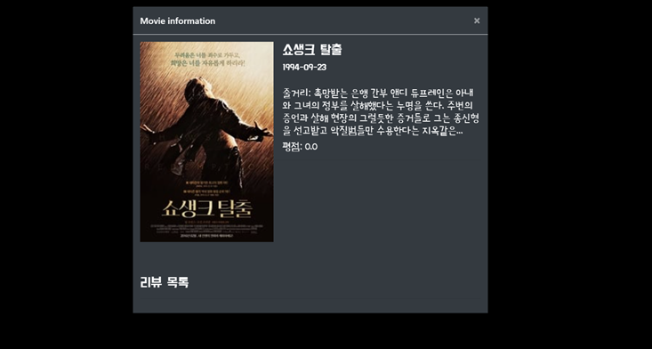

* 로그인하지 않은 일반 사용자도 리뷰 조회 가능
* 매긴 평점, 리뷰 내용, 작성자 정보 포함


#### C. 영화 리뷰 작성 / 수정 / 삭제

1) 영화 리뷰 작성

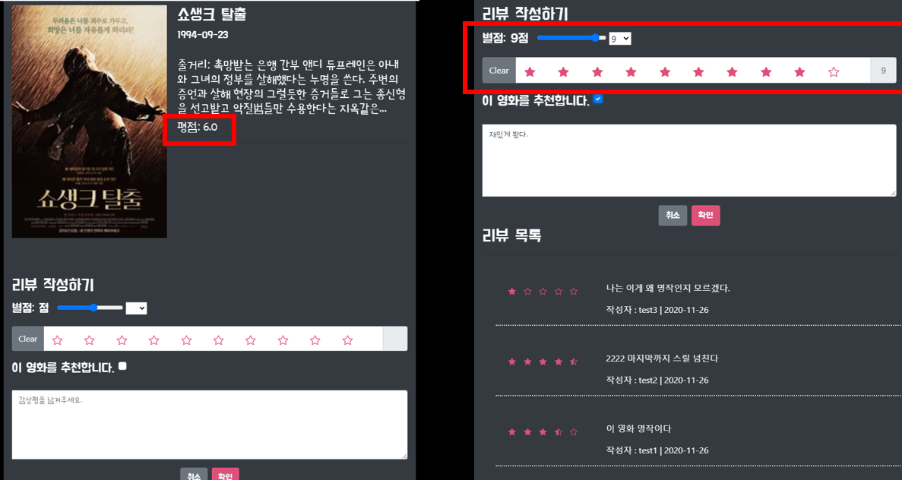

* 로그인 한 사용자에 대해 리뷰 Form 노출

* 관리자의 경우 리뷰 조작을 막기 위해 리뷰 기능 사용 불가

* 평점 입력에 대한 다양한 방법 제공과 실시간 적용으로 시각적 피드백 제공

* TMDB에서 정보를 받아와서 DB에 저장한상태고 우리 사이트에서 서비스를 하게 되면서 평점이 반영된다.

* 추천 수도 반영이 즉각적으로 이루어짐

  


2) 영화 리뷰 수정

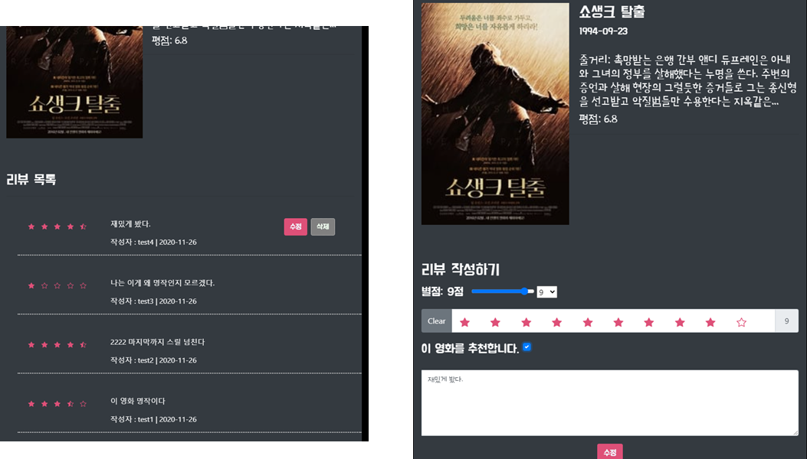

* 작성자와 로그인 사용자가 같을 경우 수정 버튼 활성화
* 이전 작성 데이터를 제공

3) 영화 리뷰 삭제

* 작성자와 로그인 사용자가 같을 경우 삭제 버튼 활성화


#### D. 커뮤니티 게시판

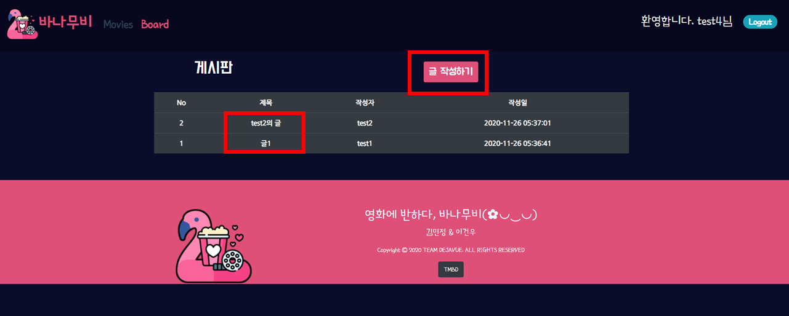

1) 게시판 목록

* 게시글의 목록을 보여준다.

  

2) 글 등록

* 로그인한 사용자만 글 등록 가능


3) 글 수정

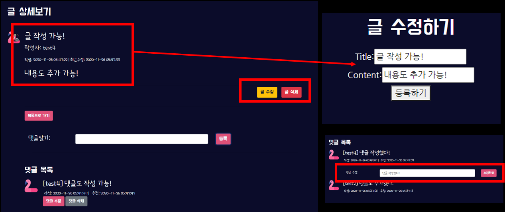

* 작성자와 로그인한 유저가 같을 경우 수정 버튼 활성화

* 수정 시 기존 데이터를 Form에 채워줌으로써 편리성 제공

  

4) 글 삭제

* 작성자와 로그인한 유저가 같을 경우 수정 버튼 활성화
* 관리자 로그인 시 모든 글에 대한 삭제 권한을 가짐


#### E. [추가기능] 영화 관리 / 추가 (관리자 기능) : 

**일반 회원뿐만아니라 서비스를 제공하는 주체도 고객이기 때문에 플랫폼처럼 만들고자 함**


1) 영화 리스트

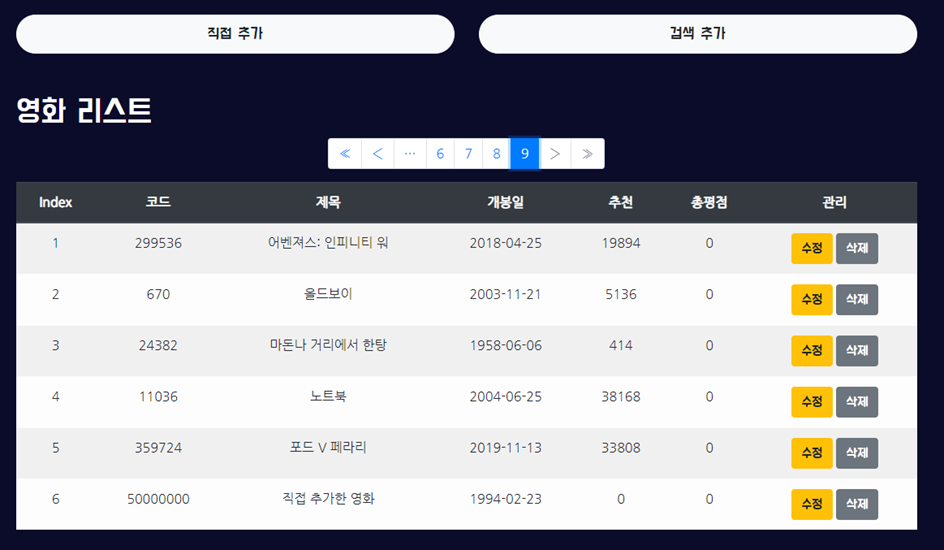

* 현재 사이트에 등록된 영화 리스트 조회 가능
* 페이지네이션을 통해 다량의 데이터를 깔끔하게 표현


** 영화 추가 **

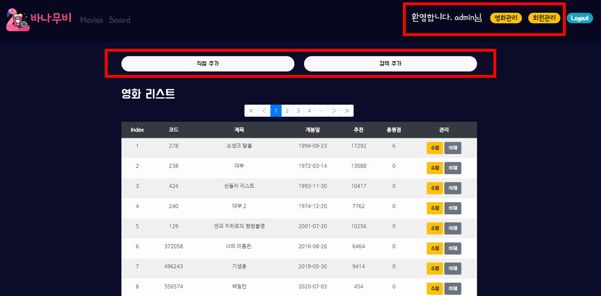


2) 영화 직접 추가

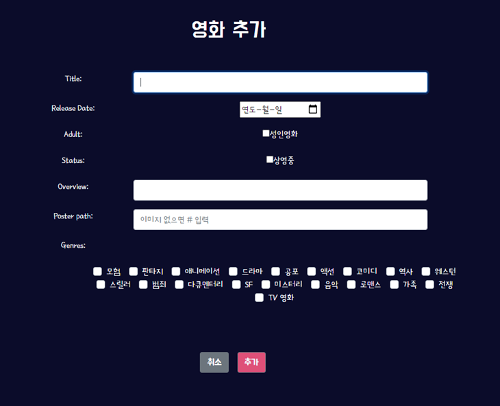

* 입력 Form을 통해 직접 영화 정보를 추가할 수 있도록 구현
  * 장르의 경우 여러 값을 받을 수 있도록 체크박스로 설계
  * 추가된 영화에 고유 코드 숫자를 부여하기 위해 일정 숫자부터 카운트 되도록 구현
  
  
  
  

3) 영화 검색 추가

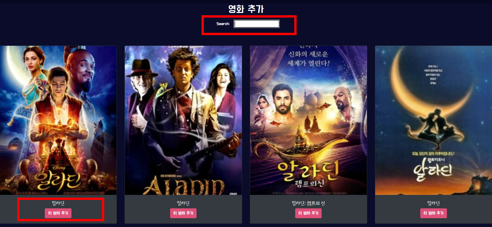

* 검색어를 통해 TMDB로 API요청을 보내고, 요청으로 목록을 받아와서 선택한 영화에 대해 DB에 추가되도록 설계


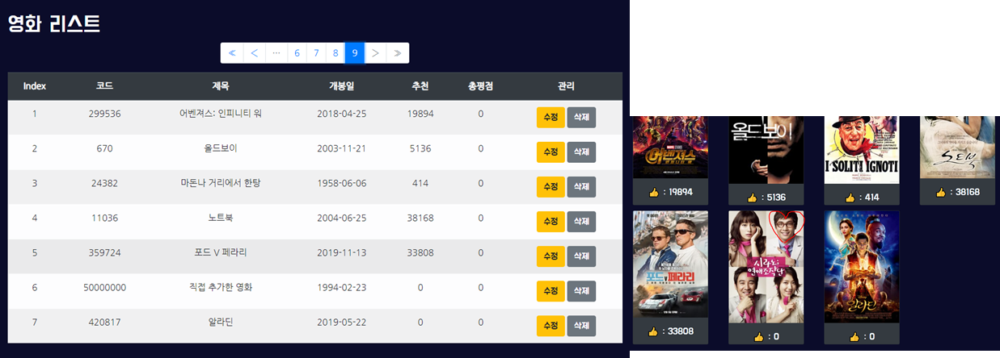

추가된 영화는 바로 DB에 반영되고, 리스트에서도 확인하여 관리 가능


4) 영화 수정

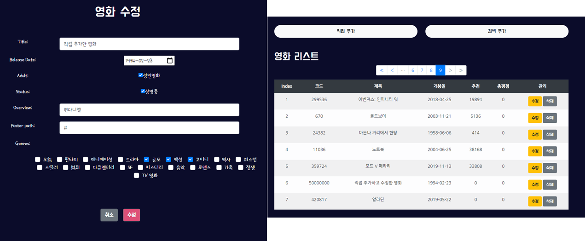

* 선택한 영화 수정 가능
* 기존 데이터를 Form에 채워줌으로써 편리성 제공
* 수정사항은 바로 반영되어 영화 목록에서도 확인 가능


5) 영화 삭제


* 리스트에서 삭제 가능
* 삭제 여부 팝업을 제공
* 영화 삭제를 통해 DB에서 삭제 


#### F. 회원 조회 및 관리 (관리자 기능)

1) 전체 회원 목록 조회 가능

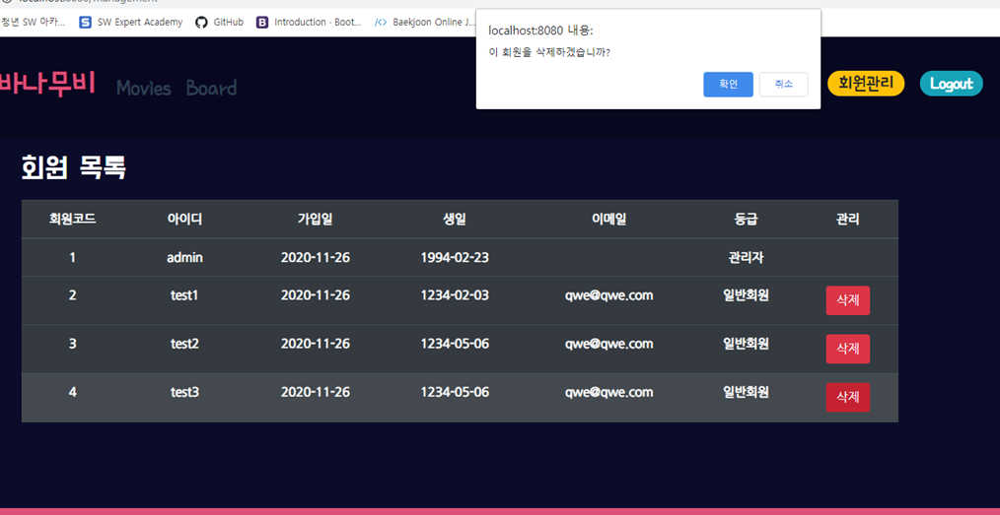


2) 회원 삭제

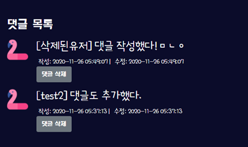

* 관리자 제외 모든 회원을 관리할 수 있도록 삭제 버튼 활성화
* 회원 삭제 시 리뷰 및 게시글이 삭제되지 않도록, `on_delete` 에 `set` 함수를 적용해 "삭제된유저" 를 pk로 연결시켜 데이터가 유지되도록 구현
* 삭제 시 삭제 진행 여부 확인 팝업 제공


#### G. 사용자 맞춤 영화 추천

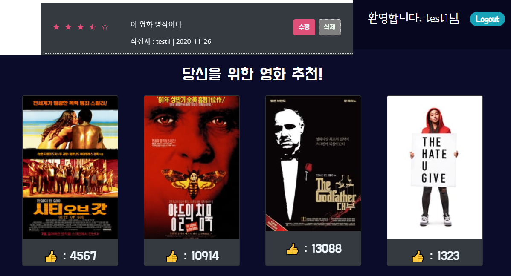

1) 회원에게 맞춤 영화 4개 추천

* 회원이 영화에 매긴 평점들의 정보를 바탕으로 장르 가중치를 계산하여 개인에게 맞는 영화 추천


### 5. 느낀 점

#### 1) New

* router.push 기능을 사용할 때 데이터를 파라미터로 전달할 수 있다. 

  

#### 2) 오류, 어려웠던 점 및 해결

* 데이터를 프론트와 백에서 주고 받는 과정에서 데이터 형식이 달라서 ForeignKey를 포함한 모델에 대한 Serializer 해결이 어려웠다.

  * Serializer를모델 당 1개만 정의해야 한다는 편견을 깨고, 필요한 데이터에 맞춰서 복수 개 정의하였다.

  * ForeignKey의 경우 시리얼라이저 필드에 해당하는 항목에 대해 또 Serializer를 정의하여 데이터 전달 이슈를 해결할 수 있었다.

    

#### 3) 후기

* [김민정] 초기에 모델 설계를 탄탄하게 했다고 생각했는데, 막상 구현을 시작해 보니 기능이 추가되고 변경되면서 모델이 변경되는 경우들이 있었다. 개발 과정에서는 Agile방식이 적절하다고 느꼈고 언제든지 설계가 변경될 수 있다는 인식이 생겼다.  
* [김민정] 온라인으로 진행했기에 소통에 어려움을 겪진 않을까 우려되었지만, 여러가지 협업 툴을 활용해 빠르고 정확한 의사소통이 가능했다. Trello, Slack, Sourcetree 를 활용하였다. 
* [김민정] 팀워크가 잘 맞아서 정해진 시간 내에 계획했던 필수 기능들을 모두 구현할 수 있었다.
* [김민정] 데이터의 흐름과 생명주기 등을 모두 경험하기 위해서 프론트엔드와 백엔드를 정확하게 나누기보단, 기능 별로 역할을 나누었다. 처음에는 프론트엔드 백엔드 모두 각자 해내야 했기 때문에 속도가 느렸지만 정확한 이해를 하게 되었고, 구현 속도가 점점 빨라질 수 있었다. 지금은 프론트엔드, 백엔드를 나눠서 나눠진 것만 하는 것보다는 모든 흐름을 아는 것이 중요하다고 생각한다. 추후 프론트엔드, 백엔드 어떤 업무를 하더라도 소통이 가능한 풀스택 기반의 개발자가 되어야 한다고 생각한다.
* [이건우] 여러가지 툴을 활용해 프로젝트를 편하게 설계할 수 있었다.
* [이건우] 프로젝트를 진행함에 있어 페어와의 소통이 프로젝트 진행에 얼마나 중요한지 느끼게 되었다. (소통이 잘 되어 큰 어려움이 없었다.)
* [이건우] 진행 과정 중 원하는 방향으로 구현이 되지 않을 때, 그 부분을 계속 붙잡고 있기 보다는 초기 모델을 보고, 필요한 부분을 수정하는 등, 다양한 접근으로 문제를 해결할 수 있었다.


## 개발환경

### 1. 개발 환경

#### A. 언어

* Python 3.7.7
* Django 3.1.3
* Node 14.15.0
* Vue.js @vue/cli 4.5.8 


#### B. 도구

* vsCode
* Chrome Browser


#### C. 아키텍쳐

* Django REST API 서버 & Vue.js


### 2. 환경 추가 설정

**필수** 사전 생성 파일

* `.env.local` 

  * 생성 경로 : final-pjt-front/.env./local

  ```
  VUE_APP_SERVER_URL=서버주소
  
  VUE_APP_SEARCH_URL=https://api.themoviedb.org/3/search/movie?api_key
  
  VUE_APP_API_KEY=TMDB키값
  ```

  * 예시

  

  


----


## 개발 Tip 정리 (팀원용)


### 1. 화면에 pk 숫자 대신 username 출력하는 방법

일반적으로 아래와 같이 models.py를 정의할 때 테이블에 user를 ForiegnKey로 잡는다.


이렇게 하게 되면 user의 pk가 테이블 데이터가 저장이 되고, 시리얼라이징을 통해 vue로 값을 전달할 때 user의 username이 전달되는 것이 아니라 pk인 숫자가 전달된다.


위와 같이 시리얼라이저를 만들 때, user로 하기 때문에 자연스럽게 pk 값만 들어가고 전달이 되는 것

따라서 **유저 시리얼라이저를 만들고 'user'에 매핑할 user 객체를 생성해주면 된다. **


1. `get_user_model` 을 import한다. (User를 직접 불러오지 않고 안전하게 get_user_model을 써야 함)

   ```python
   from django.contrib.auth import get_user_model
   ```

2. User에서 가져오고 싶은 값을 골라서 Serializer 클래스를 만든다.

3. 원래 있던 시리얼라이저에 내가 만든 **User시리얼라이저 인스턴스 생성**

   * 이 때 인스턴스의 이름은 반드시 **<u>필드의 컬럼명과 동일해야 한다.</u>**

* 결과 화면

  

**※주의사항 : 이렇게 데이터를 전송했을 경우, vue 에서 타입을 undefined로 잡는 경우가 있다. 따라서 이럴 경우에는 템플릿이 아닌 함수에서 username 을 직접 this변수에 저장해서 그대로 출력한다.**


#### ManyToMany필드에서 여러 값을 보낼 때도 같은 방법을 사용한다. 

단, 여러 값이 들어가므로 커스터마이징한 인자에 `many=True` 를 설정해준다. 


